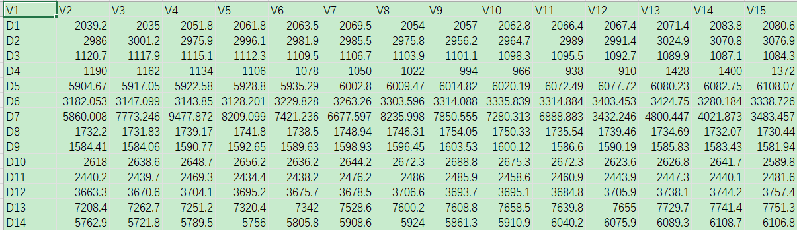
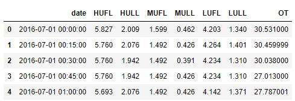
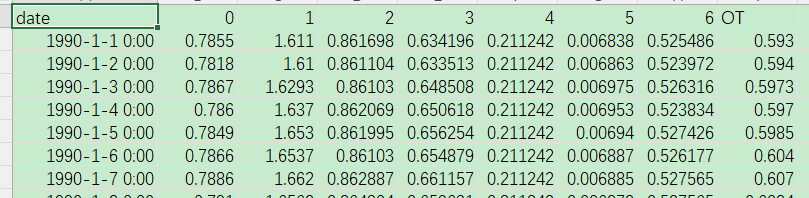
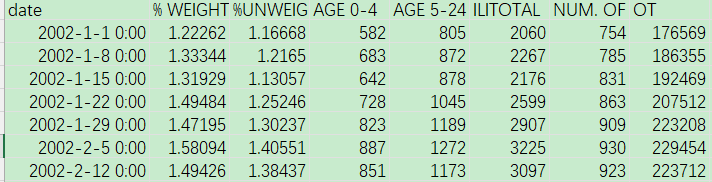
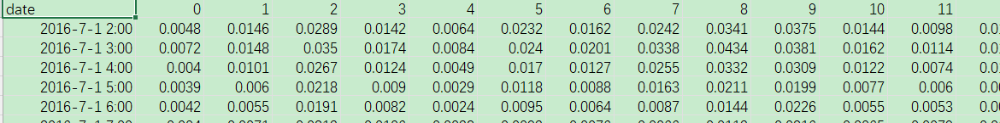
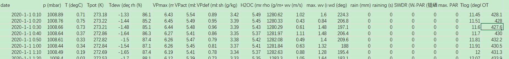

# time series  datasets

## short_term_forecast

### M4

M4数据集是时间序列预测领域的一个标准数据集，由大约**100,000个时间序列**组成，覆盖了各种类型的时间序列，包括**日、周、月、季度和年度级别**的数据。它是M1-M3数据集的继任者，旨在成为一个更全面、更丰富的数据集。M4数据集是由Monash大学的Rob Hyndman教授领导的一个团队创建的，这个团队在预测领域有很高的声誉。

该数据集包含了多个不同的时间序列，包括宏观经济数据、金融时间序列、人口统计数据、交通运输数据等等。每个时间序列包含了若干个预测问题，如**预测未来几个时间点的值、预测未来一段时间内的趋势**等等。M4数据集中的时间序列还包含了各种类型的季节性和趋势性，以及突发事件等因素的影响。

M4数据集是时间序列预测算法的一个基准，它被广泛用于评估和比较不同的时间序列预测算法和模型。对M4数据集进行预测是一个非常有挑战性的任务，因为它涵盖了各种类型的时间序列和不同的预测问题，需要对预测算法和模型进行充分的测试和优化。


M4数据集包含了许多时序数据，每个时序数据对应一个csv文件，其中列名和行名的意义如下：

 **每一列代表一种时间序列，每一行代表该时间序列的一个时间步长的观测值。 ** 

 行表示 1个数据  列表示一个特征

## long_term_forecast

### electricity

Electricity是一个公开的时间序列数据集，用于电力负荷预测。它包含了一个月（2011年1月）的美国公用事业公司（PJM）电力负荷数据，以及该月每小时的天气数据。数据集中的电力负荷值是以MW（兆瓦）为单位的实际测量值，而气象数据包括温度、湿度、风速和风向等。该数据集旨在帮助开发人员设计和评估各种电力负荷预测算法和模型。

1. electricity.csv：包含电力负荷的时间序列数据，每行是一个时间戳和其对应的电力负荷值。

   这些文件的时间戳均为按小时计算的日期时间格式。数据集中的时间跨度为2011年1月1日至2011年1月31日，共计744个时间戳。   16384列

   

### ETT-small


 电力分配问题是电网根据顺序变化的需求管理电力分配到不同用户区域。但要预测特定用户区域的未来需求是困难的，因为它随工作日、假日、季节、天气、温度等的不同因素变化而变化。现有预测方法不能适用于长期真实世界数据的高精度长期预测，并且任何错误的预测都可能产生严重的后果。因此当前没有一种有效的方法来预测未来的用电量，管理人员就不得不根据经验值做出决策，而经验值的阈值通常远高于实际需求。保守的策略导致不必要的电力和设备折旧浪费。值得注意的是，变压器的油温可以有效反映电力变压器的工况。我们题出最有效的策略之一，是预测变压器的油温同时设法避免不必要的浪费。 为了解决这个问题，我们的团队与北京国网富达科技发展公司建立了一个平台并收集了 2 年的数据。我们用它来预测电力变压器的油温并研究电力变压器极限负载能力。

 我们提供了涉及电力变压器的多个数据集，用于支撑” 长时间序列” 相关的研究。所有的数据都经过了预处理，并且以`.csv` 的格式存储。这些数据的时间跨度为 2016 年 7 月到 2018 年 7 月，我们将会在未来更新到 2019 年的数据。

*数据列表*

-  **ETT-small**：含有 2 个电力变压器（来自 2 个站点）的数据，包括负载、油温。
-  **ETT-large**：含有 39 个电力变压器（来自 39 个站点）的数据，包括负载、油温。
-  **ETT-full**：含有 69 个电力变压器（来自 39 个站点）的数据，包括负载、油温、位置、气候、需求。

*数据列表*

-  **ETT-small**：含有 2 个电力变压器（来自 2 个站点）的数据，包括负载、油温。
-  **ETT-large**：含有 39 个电力变压器（来自 39 个站点）的数据，包括负载、油温。
-  **ETT-full**：含有 69 个电力变压器（来自 39 个站点）的数据，包括负载、油温、位置、气候、需求。

####  ETT-small:

我们提供了两年的数据，每个数据点每分钟记录一次（用 *m* 标记），它们分别来自中国同一个省的两个不同地区，分别名为 ETT-small-m1 和 ETT-small-m2。每个数据集包含 2 年 * 365 天 * 24 小时 * 4 = 70,080 数据点。 此外，我们还提供一个小时级别粒度的数据集变体使用（用 *h* 标记），即 ETT-small-h1 和 ETT-small-h2。 每个数据点均包含 8 维特征，包括数据点的记录日期、预测值 “油温” 以及 6 个不同类型的外部负载值。



###  exchange_rate 

exchange_rate 数据集包含了 **8 种货币对相对于美元的汇率**，时间范围从 2000 年到 2021 年。该数据集可用于进行汇率预测、货币政策分析和风险管理等任务。数据集中的每个货币对都有其对应的列，每行代表一个日期和其对应的汇率值。数据集中的时间间隔为每日，但是有些日期的数据可能缺失。该数据集是一个非常常用的金融时间序列数据集，被广泛应用于金融时间序列分析和预测任务中。

该数据集为外汇汇率数据集，包含**日期和7个货币对相对于美元的汇率数据。**其中0-6列分别为对应的货币对，**OT列为其他货币对的加权平均汇率**。每行数据对应一个日期，日期格式为年-月-日 时:分:秒，但是该数据集中时、分、秒均为0。数据集的时间范围为1990年1月1日至2021年1月1日。



### national_illness

 该数据集名为national_illness，包含了美国每周的流感样本检测数据，记录了日期、加权和非加权流感样本的比例、0-4岁和5-24岁年龄段的样本数、总样本数、提供者数量等信息。数据集的单位为每1000人，提供者数量是针对整个国家而不是特定地区。数据集的时间跨度从2002年1月1日至2020年10月9日。

- date：**流感发病日期**（week）
- % WEIGHTED ILI：加权流感样本中患病比例的百分比
- % UNWEIGHTED ILI：未加权流感样本中患病比例的百分比
- AGE 0-4：0-4岁年龄组的流感患病人数
- AGE 5-24：5-24岁年龄组的流感患病人数
- ILITOTAL：所有年龄组的流感患病人数
- NUM. OF PROVIDERS：每周报告流感样本数据的医疗保健提供者数量
- OT：表示是否在感应器的工作日之外（"1"表示是，在周末或假期之类的时间）




### Traffic

Traffic时间序列数据集通常包含来自交通系统的各种数据，例如：

1. 车流量：记录每天、每小时、每分钟或每秒通过道路的车辆数量。
2. 速度：记录车辆在不同时段内的速度。
3. 堵车情况：记录交通拥堵的程度和持续时间。
4. 车祸数量：记录每天、每周或每月发生的交通事故数量。
5. 公交车或火车的运行时间和停靠站点：记录公共交通工具的到站时间、离站时间和停靠站点信息。



###  weather

 记录了大气环境参数的时间序列数据集。

- date：记录的日期和时间

- p (mbar)：气压，单位为毫巴

- T (degC)：气温，单位为摄氏度

- Tpot (K)：温度的等势温度，单位为开尔文

- Tdew (degC)：露点温度，即当空气冷却到一定温度时，其中的水蒸气会开始凝结成露水，单位为摄氏度

- rh (%)：相对湿度，即空气中水蒸气的含量与该温度下的最大含量的比值，单位为百分比

- VPmax (mbar)：饱和水蒸气压力，单位为毫巴

- VPact (mbar)：实际水蒸气压力，单位为毫巴

- VPdef (mbar)：水蒸气压力的差，即饱和水蒸气压力与实际水蒸气压力之差，单位为毫巴

- sh (g/kg)：比湿，即单位质量的空气中所含的水蒸气的质量，单位为克/千克

- H2OC (mmol/mol)：水蒸气的分压，单位为毫摩尔/毫摩尔

- rho (g/m**3)：空气密度，单位为克/立方米

- wv (m/s)：风速，单位为米/秒

- max. wv (m/s)：最大风速，单位为米/秒

- wd (deg)：风向，单位为度数

- rain (mm)：降雨量，单位为毫米

- raining (s)：降雨时间长度，单位为秒

- SWDR (W/m²)：短波辐射，单位为瓦特/平方米

- PAR (μmol/m²s)：光合有效辐射，单位为微摩尔/平方米/秒

- max. PAR (μmol/m²s)：最大光合有效辐射，单位为微摩尔/平方米/秒

- Tlog (degC)：土壤温度，单位为摄氏度

- OT：其他特征

  

imputation（插值任务 缺失值预测）

##  classification

### EthanolConcentration

EthanolConcentration" 数据集是用于建立基于时间序列的回归模型的数据集。该数据集包含了一系列记录了在不同条件下生产生物燃料乙醇的实验数据，包括一些相关的变量如温度、压力、发酵时间和乙醇浓度。

数据集的每个样本都包含了以下变量：

- 时间戳
- 温度
- 压力
- 发酵时间
- 乙醇浓度

该数据集中包含了 9565 个观测值和 5 个变量。其中，乙醇浓度是目标变量，需要根据其他变量进行预测。

由于该数据集存在一些缺失值，因此在建立回归模型之前需要进行缺失值的填充处理。可以使用一些基于时间序列的方法，例如线性插值或基于 kNN 算法的填充方法。填充好缺失值之后，可以使用各种回归模型，如线性回归、决策树回归或神经网络回归等，来预测乙醇浓度。

该数据集可以用于研究生物燃料乙醇的生产过程，并为建立预测模型提供了实验数据。

## ts

时间序列数据通常是以.ts文件格式保存的，但是我们可以通过一些工具将其转换成.csv格式，以便在常见的数据处理软件中使用。以下是一些常用的方法：

1. 使用Python：使用Python中的pandas库，可以将.ts文件读取为一个DataFrame对象，然后将其转换为.csv文件。示例代码如下：

```python
import pandas as pd
data = pd.read_csv('data.ts', sep='\t', header=None)
data.to_csv('data.csv', index=False)

```

1. 使用Excel：打开Excel软件，选择“数据”菜单下的“从文本/CSV导入”选项，然后选择.ts文件并按照向导步骤导入数据。最后将数据保存为.csv格式即可。
2. 使用在线转换工具：有一些在线的文件格式转换工具可以将.ts文件转换为.csv格式，比如Zamzar、Convertio等，只需上传文件并选择输出格式即可转换。

## npy

.npy 文件是 NumPy 数组的二进制文件格式，用于存储多维数组的数据。要将 .npy 文件转换为 CSV 格式，可以使用 NumPy 库的 load 函数来加载 .npy 文件，然后使用 pandas 库的 DataFrame 和 to_csv 函数将其保存为 CSV 文件。

```python
import numpy as np
import pandas as pd

# 加载 .npy 文件
data = np.load('data.npy')

# 将数据转换为 DataFrame
df = pd.DataFrame(data)

# 将 DataFrame 保存为 CSV 文件
df.to_csv('data.csv', index=False)

```

