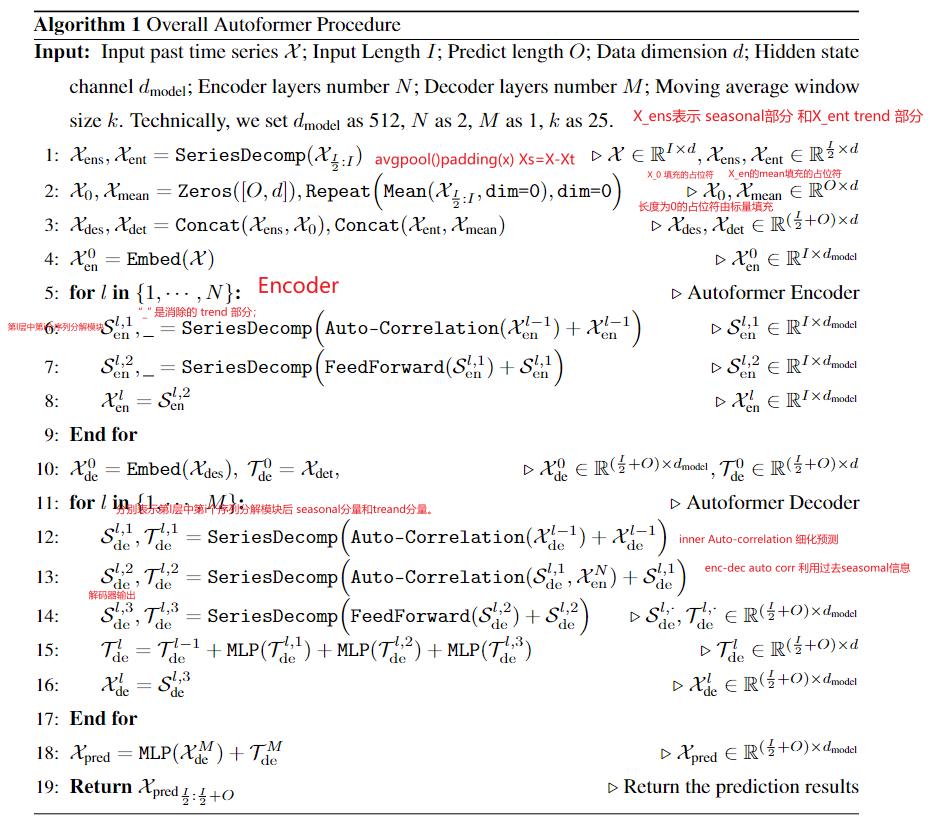
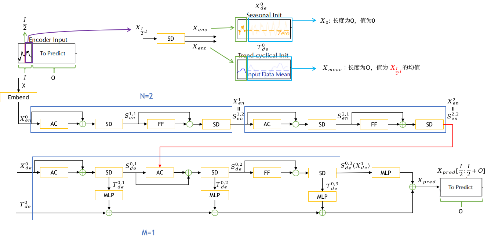
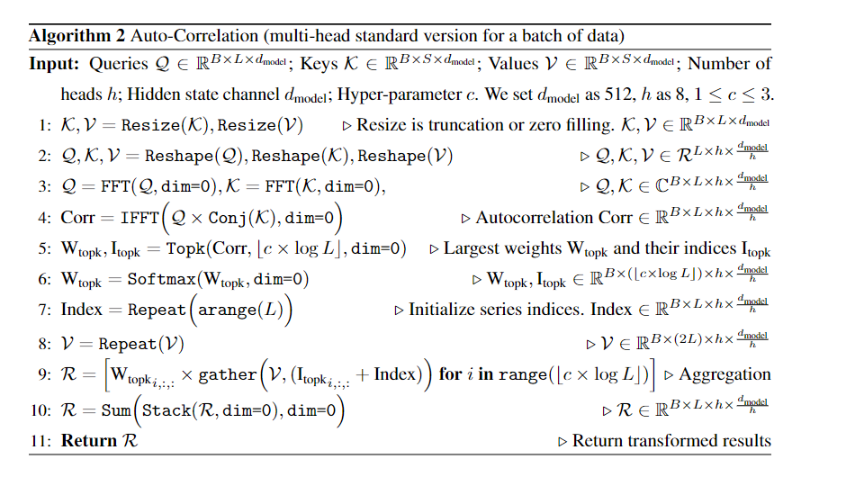

# Autoformer

作为时间序列分析中的一种标准方法，时间序列分解 [1, 33] 将时间序列解构为几个部分，每个部分代表一种更可预测的基本模式类别。它主要用于探索随着时间推移的历史变化。对于预测任务，在预测未来序列 [20, 2] 之前，总是使用分解作为历史序列的预处理，例如带有 **trend-seasonality 分解的 Prophet [39] 和带有基扩展（basis expansion）**的 N-BEATS [29] 和 使用矩阵分解的 DeepGLO [35] 。然而，这种预处理受限于历史序列的简单分解效应，并忽略了长期未来序列底层模式之间的层次交互。本文从一个新的渐进维度提出分解思想。我们的 Autoformer 将分解作为深度模型的内部块，它可以在整个预测过程中逐步分解隐藏序列，包括过去的序列和预测的中间结果。

我们将 Transformer [41] 更新为深度分解架构（图 1），包括内置序列分解模块、Auto-Correlation 机制以及相应的 Encoder and Decoder。

**Encoder 通过序列分解模块（蓝色模块）消除了 long-term trend-cyclical 部分，并专注于 seasonal 模式建模。Decoder 逐步累积从隐藏变量中提取的 trend 部分。 encoder-decoder Auto-Correlation（Decoder 中的中间绿色块）利用来自 encoder 的过去 seasonal 信息。**

时间序列一般可以分为  趋势 +季节性+残差。"Long-term trend-cyclical" 通常被认为是趋势成分的一部分，因为它反映了较长时间尺度上的趋势变化，但也包括一些周期性的变化。

**序列分解模块**   

为了在 long-term 预测上下文中学习复杂的时间模式，我们采用分解的思想 [1, 33]，它可以将序列分为 trend-cyclical 部分和 seasonal 部分。 这两个部分分别反映了该序列的 long-term 发展和 seasonality。

对于未来的序列来说，直接分解是无法实现的，因为未来是未知的。 为了解决这个难题，我们提出了一个序列分解模块作为 Autoformer 的内部操作（图 1），它可以**从预测的中间隐藏变量中逐步提取 long-term 平稳 trend** 。 具体而言，**我们采用 moving average 以平滑周期性波动并突出 long-term trends。** 对于 length-L 的输入序列 $X \in \mathbb{R}^{L \times d}$ 过程为:
$$
\begin{aligned}
& \mathcal{X}_{\mathrm{t}}=\operatorname{Avg} \operatorname{Pool}(\operatorname{Padding}(\mathcal{X})) \\
& \mathcal{X}_{\mathrm{s}}=\mathcal{X}-\mathcal{X}_{\mathrm{t}}
\end{aligned}
$$
这里 $X_t, X_s \in \mathbb{R}^{L \times d}$ 分别代表 **seasonal 部分和 提取的 trend-cyclical 部分。**我们采用 带有 padding 操作的 AvgPool (・) 进行 moving average ，填充操作用来保持序列长度不变。我们用$X_s, X_t=\operatorname{SeriesDecomp}(X)$ 来总结上面的方程，这是一个模型内部模块

**模型输入**

Encoder 部分的输入是过去的 $I$个时间步 $X_{e n} \in \mathbb{R}^{I \times d}$ 作为一种分解架构（图 1），**Autoformer decoder 的输入包含要细化的 seasonal 部分**$X_{\text {des }} \in \mathbb{R}^{\left(\frac{I}{2}+O\right) \times d}$ 和 trend-cyclical 部分 $X_{\text {det }} \in \mathbb{R}^{\left(\frac{I}{2}+O\right) \times d}$。每个初始化由两部分组成：由 encoder 的输入$X_{en}$ 的后半部分分解而成，用 length $\frac{I}{2}$ 以提供最近的信息，长度为 O 的占位符由标量填充。 其公式如下:
$$
\begin{aligned}
\mathcal{X}_{\mathrm{ens}}, \mathcal{X}_{\mathrm{ent}} & =\operatorname{Series} \operatorname{Decomp}\left(\mathcal{X}_{\mathrm{en} \frac{I}{2}: I}\right) \\
\mathcal{X}_{\mathrm{des}} & =\operatorname{Concat}\left(\mathcal{X}_{\mathrm{ens}}, \mathcal{X}_0\right) \\
\mathcal{X}_{\mathrm{det}} & =\operatorname{Concat}\left(\mathcal{X}_{\mathrm{ent}}, \mathcal{X}_{\text {Mean }}\right)
\end{aligned}
$$
$X_{e n s}, X_{e n t} \in \mathbb{R}^{\frac{1}{2} \times d}$ 分别表示**$X_{en}$ 的 seasonal 部分和 trend-cyclical 部分；** $X_0, X_{\text {Mean }} \in \mathbb{R}^{O \times d}$

分别表示被 0 填充的占位符和被$X_{en}$的 mean 填充的占位符。

**Encoder**

如图 1 所示，encoder 侧重于 seasonal 部分建模。 encoder 的输出包含过去的 seasonal 信息，将作为交叉（cross）信息帮助 decoder 细化预测结果。 假设我们有 N 个 encoder 层。第$l$个 encoder 的整体方程总结为$X_l^{e n}=E n \operatorname{coder}\left(X_{l-1}^{e n}\right)$
$$
\begin{aligned}
& \mathcal{S}_{\mathrm{en}}^{l, 1},_{-}=\text {SeriesDecomp }\left(\text { Auto-Correlation }\left(\mathcal{X}_{\mathrm{en}}^{l-1}\right)+\mathcal{X}_{\mathrm{en}}^{l-1}\right) \\
& \mathcal{S}_{\mathrm{en}}^{l, 2},_{-}=\operatorname{SeriesDecomp}\left(\text { FeedForward }\left(\mathcal{S}_{\mathrm{en}}^{l, 1}\right)+\mathcal{S}_{\mathrm{en}}^{l, 1}\right)
\end{aligned}
$$
这里 “_” 是消除的 trend 部分；  

$\mathcal{X}_{\mathrm{en}}^l=\mathcal{S}_{\mathrm{en}}^{l, 2}, l \in\{1, \cdots, N\}$ 表示第$l$个encoder层输出;$\mathcal{S}_{\mathrm{en}}^{l, i}, i \in\{1,2\}$ 表示第$l$层中的第$i$个序列分解模块后的seasonal部分。

**Decoder**

trend-cyclical 部分的累积结构和 seasonal 部分的堆叠 Auto-Correlation 机制 。 每个 Decoder 层包含 **inner Auto-Correlation** 和 **encoder-decoder Auto-Correlation**，它们可以分别 细化预测和利用过去的 seasonal 信息。该模型在 Decoder 期间从中间隐藏变量中提取潜在 trend，从而允许 Autoformer 逐步细化 trend 预测并消除干扰信息，以便在 Auto-Correlation 中发现基于周期的依赖关系。 假设有 M 个 decoder 层。  **使用来自 encoder 的隐变量 **$X_{e n}^N$ 第$l$ 个解码器层的方程可以概括为

$X_l^{d e}=\operatorname{Decoder}\left(X_{l-1}^{d e}, X_{e n}^N\right)$ Decoder 可以如下公式化： 
$$
\begin{aligned}
\mathcal{S}_{\mathrm{de}}^{l, 1}, \mathcal{T}_{\mathrm{de}}^{l, 1} & =\operatorname{SeriesDecomp}\left(\text { Auto-Correlation }\left(\mathcal{X}_{\mathrm{de}}^{l-1}\right)+\mathcal{X}_{\mathrm{de}}^{l-1}\right) \\
\mathcal{S}_{\mathrm{de}}^{l, 2}, \mathcal{T}_{\mathrm{de}}^{l, 2} & =\operatorname{SeriesDecomp}\left(\text { Auto-Correlation }\left(\mathcal{S}_{\mathrm{de}}^{l, 1}, \mathcal{X}_{\mathrm{en}}^N\right)+\mathcal{S}_{\mathrm{de}}^{l, 1}\right) \\
\mathcal{S}_{\mathrm{de}}^{l, 3}, \mathcal{T}_{\mathrm{de}}^{l, 3} & =\operatorname{SeriesDecomp}\left(\text { FeedForward }\left(\mathcal{S}_{\mathrm{de}}^{l, 2}\right)+\mathcal{S}_{\mathrm{de}}^{l, 2}\right) \\
\mathcal{T}_{\mathrm{de}}^l & =\mathcal{T}_{\mathrm{de}}^{l-1}+\mathcal{W}_{l, 1} * \mathcal{T}_{\mathrm{de}}^{l, 1}+\mathcal{W}_{l, 2} * \mathcal{T}_{\mathrm{de}}^{l, 2}+\mathcal{W}_{l, 3} * \mathcal{T}_{\mathrm{de}}^{l, 3}
\end{aligned}
$$
$\mathcal{X}_{\mathrm{de}}^l=\mathcal{S}_{\mathrm{de}}^{,, 3}, l \in\{1, \cdots, M\}$ 表示第$l$个解码器层的输出;$X_{d e}^0$是$X_{des}$ 的嵌入，用于深度变换 $\mathcal{T}_{\text {de }}^0=\mathcal{X}_{\text {det }}$用于累积。 $\mathcal{S}_{\mathrm{de}}^{l, i}, \mathcal{T}_{\mathrm{de}}^{l, i}, i \in\{1,2,3\}$  分别表示第$l$层中第$i$个序列分解模块后seasonal 分量和 trend-cyclical 分量。 $\mathcal{W}_{l, i}, i \in\{1,2,3\}$ 表示第$i$ 个提取的trend $\tau_{d e}^{l, i}$的投影。

最终的预测是两个细化的分解分量之和，为 $\mathcal{W}_{\mathcal{S}} * \mathcal{X}_{\mathrm{de}}^M+\mathcal{T}_{\mathrm{de}}^M$ 其中$w_s$ 是用来将深度变换的 seasonal 分量 $X_{d e}^M$ 投影到目标维度。

