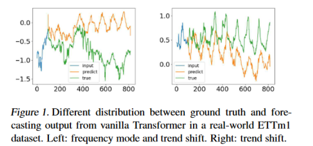

# fedformer

## 摘要

尽管基于Transformer的方法显著改善了长期序列预测的最新结果，**但它们不仅计算成本高，更重要的是，无法捕捉时间序列的全局视图 (例如总体趋势)**。为了解决这些问题，我们提出将 Transformer 与季节趋势分解方法相结合，其中分解方法捕捉时间序列的全局轮廓，而 Transformer 捕捉更详细的结构。为了进一步提高 Transformer 的长期预测性能，我们利**用了大多数时间序列倾向于在众所周知的基础上 (如傅立叶变换) 具有稀疏表示的事实，开发了频率增强 Transformer。**除了更有效之外，被称为频率增强分解Transformer的方法比标准变压器效率更高，其复杂度与序列长度成线性关系。我们对 6 个基准数据集的实证研究表明，与最先进的方法相比，FEDformer 在多变量和单变量时间序列中分别可以减少 14.8% 和 22.6% 的预测误差。

- 长时间序列问题是一个研究很广泛的问题

  - **RNN 以及变体会遇到梯度消失 / 梯度爆炸**，这会在很大程度上限制他们的表现
  - Transformer 的方法会导致很高的计算复杂度，以及很大的内存消耗，这也会使得在长时间序列上使用 Transformer 很吃力
    - 近来有方法优化 Transformer，使其计算复杂度降低
    - 但他们大多的思路是**少取一些 QK 对**(TOPk)，这就可能导致信息的丢失，进而影响预测的精准度

- 与此同时，使用 Transformer 的方法，会在一定程度上难以**捕获时间序列的整体特征 / 分布**

   

- 比如上图，不难发现预测的结果和实际值，二者的分布有着一定的差距
- 这可能由于 **Transformer 使用的是 point-wise attention，每个时间点是独立的进行注意力计算和预测的，所以整体的、全局的特征难以维系和建模**

- 这篇论文提出了 FedTransformer
  - 在 Transformer 的架构种使用 周期 - 趋势 分解 （这一点有点类似 AutoFormer）
  - 在谱域中使用 Transformer
    - ——> 使得 Transformer 能更好地捕获全局特征
    - ——> 在不减少每个点计算 attention 时看到的其他点数量的基础上，减少复杂度

## 谱域上的时间序列表征

- 这篇论文的一个重要的问题是，经过**离散傅里叶变化后，哪些部分应该得以保留，**以表征时间序列
  - 一种方式是**保留低频部分，去除高频部分**（低频信号表示**近似**信息，高频信号表示**细节**信息）				这样的话，有一些诸如趋势变化的信息就会被丢失（这是一个高频信号）
  - 另一种方式是全部保留，但是这样的话。很多噪声是高频信号，这会扰乱预测结果

从各种频率成分中随机选取一个子集，会得到一个好的时间序列表征

- 假设我们有 m 个时间序列 $X_1(t), \cdots, X_m(t)$

- 通过傅里叶变化，我们可以将 $X_i (t)$ 转化成 **$a_i=\left(a_{i, 1}, \cdots, a_{i, d}\right)^T \in R^d$**

- 将所有时间序列进行转化，我们得到转化矩阵 $A=\left(a_1, a_2, \cdots, a_m\right)^T \in R^{m \times d}$

- 从d 个谱域成分中随机选取 s 个 (s<d)，论文通过理论证明 $A^{\prime} \in R^{m \times s}$ 可以保留大部分 A 的信息

Notation